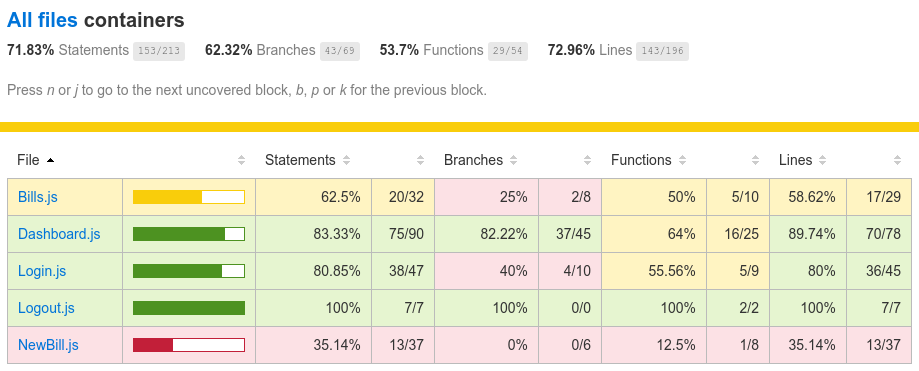

# Billed

Billed est une solution SaaS destiné aux équipes RH, servant pour l'instant à la gestion des factures pros.

Ma mission sur ce projet était de corriger une série de bug (repertoriés [ici](https://www.notion.so/a7a612fc166747e78d95aa38106a55ec)), à améliorer la couverture des tests (pour `container/NewBill.js`, `container/Bills.js` et `views/Bills`) et réaliser un scénario de test End to End pour l'interface utilisateur ( `~/Billed - Plan de test End-to-End du parcours employé.pdf` ). Pour être honnête, ce projet ne m'a pas intéréssé et j'y ai donc fait uniquement ce que l'on me demandait. 

Plusieurs raisons peuvent être évoquées : 
- Premièrement, plus j'aquiet de l'expérience sur JavaScript plus je suis épuisé par les problèmes de design et de legacy de ce langage. Notamment dans le cadre de ce projet, on aurait pu réaliser moins de tests et des tests de meilleurs qualité sur un langage avec un système de type correct et à structures de données immuables.
- Deuxièmement, la qualité du code du projet initial est désastreuse. Outre les choix de technologies qui lance ce projet avec une sacré dette technique, le code est mal organisé, peu lisible, peu/pas documenté, énormément d'effets de bord et d'éléments dépendants de states non documentés... Je pense que dans le cadre d'un vrai projet, je l'aurais entièrement re-écrit. De plus, une meilleure organisation du code (par exemple dans un [paradigme fonctionnel](https://fr.wikipedia.org/wiki/Programmation_fonctionnelle)) aurait rendu la tâche des tests bien plus facile.
- Troisièmement, je pense que l'on ne devrait pas écrire de tests après avoir réaliser le code, et encore moins du code réaliser par autrui. La bonne pratique, pourtant enseignée par OpenClassrooms dans ses cours, serait plutôt de réaliser les tests en premier quand il est plus simple de réflechir aux différents possibilités / erreurs / cas particuliers... Mais également parce que cela permet de se donner une rigeur et une structure, et de développer le code en faisant attention à remplir les tests. Alors que sur ce projet, j'ai dû avancer en tatonnant, découvrir pourquoi je ne pouvais pas facilement tester certains éléments (`VerticalLayout.js`) de manière isolée, ou pourquoi d'autres dépendaient d'effets de bords ou de state non documentés...
- Finalement, les prochains projets de la formation (notamment sur React) m'intéresse plus, notamment car il s'agit de projets plus complets où je pourrais un peu plus m'amuser à écrire la base du code par moi même, faire mes choix de technologies et d'organisation. Et peut-être tester [ReScript](https://rescript-lang.org/) sur lequel je louche depuis quelques semaines, sans avoir le temps d'y toucher.

Points d'améliorations possibles : -> Certains bugs ne sont pas corrigés (la barre verticale n'est pas fixed par exemple) -> Le site n'est pas responsive -> Les tests ne couvrent pas certains cas possibles, notamment d'erreurs ou d'echec d'effets de bord -> Le code n'est pas ou peu documenté -> Beaucoup de dépendance devrait être abandonné (JQuery est inutile, Bootstrap peut être remplacé par Tailwind) -> Le code devrait être mieux organisé (logique WebComponents par exemple), son organisation documentée, ses méthodes et fonctions pures (facilement testables)

Bref, pour toutes ces raisons, je vous invite à ne pas trop fouiller le code de ce répo ou alors à vous concentrer sur le code que j'ai modifié / ajouté 😅

Adresse du répo : https://github.com/GoulvenC/GoulvenClech_9_280621

Démo live : https://oc-p9.goulven-clech.dev/

Diapo soutenance : [Work in progress]

## Installation

Ce projet utilise le gestionnaire de paquet [NPM](https://www.npmjs.com/), le cadritiel de test [Jest](https://jestjs.io/fr/), [Express](https://expressjs.com/fr/), ainsi que plusieurs dépendants de m**** (JQuery, Bootstrap, etc) que je n'ai pas choisies.

1 - Téléchargez ce projet et ouvrez le dossier

2 - Installez les dépendances en tapant dans un terminal `yarn install`

3 - Lancez les tests en tapant dans un terminal `npm run test`. Les résultats sont consultables sur la page `/coverage/lcov-report/`.

4 - Le site ne nécéssite pas de build. Vous pouvez utiliser un plugin VSCode comme `Live Server` pour avoir un live reload.

## Organisation du projet

Honnêtement, c'est un bordel sans nom donc je ne vais pas m'amuser à expliquer. Mais quelques indications importantes :

-> `~/Billed - Plan de test End-to-End du parcours employé.pdf` : contient un plan de test end to end pour la partie utilisateur

-> `~/src/__tests__` : contient tout les tests du projet

## Taux de couverture Jest

## License

Il s'agit d'un projet dans le cadre de la formation [Développeur Front-End](https://openclassrooms.com/fr/paths/314-developpeur-front-end) d'OpenClassrooms. Le code est librement réutilisable, mais les images / logo et tout les éléments issus de l'énoncé ne m'appartiennent pas.

Si vous êtes aussi étudiant d'OC, vous pouvez librement vous inspirer de mon travail, mais je vous déconseille bien évidémment d'en copier des parties.
